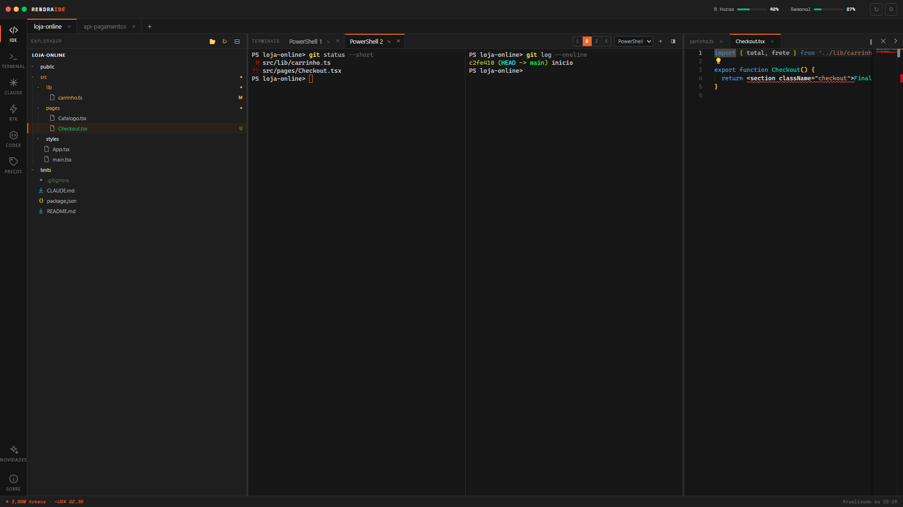
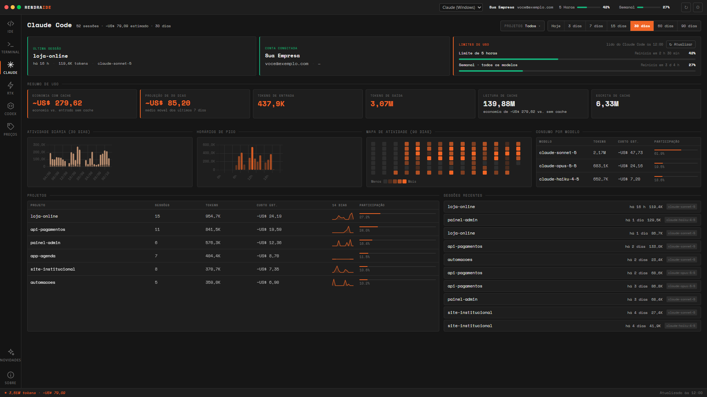
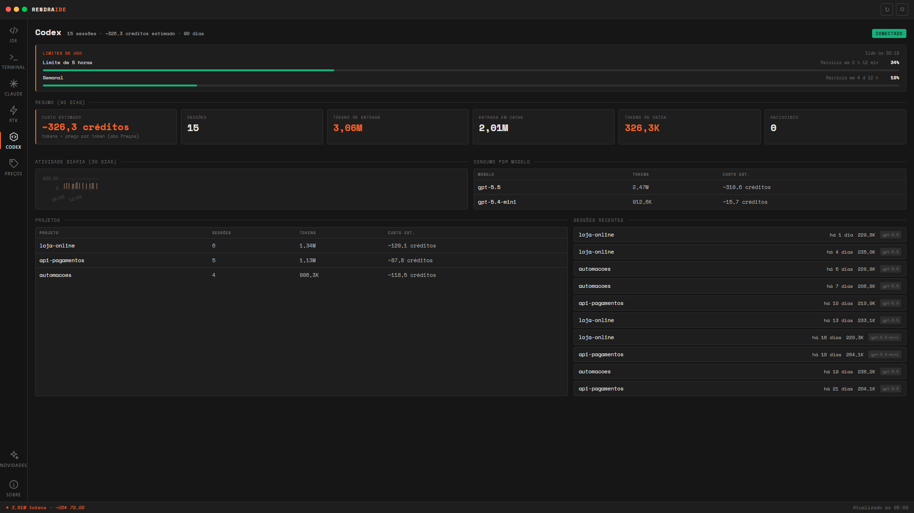
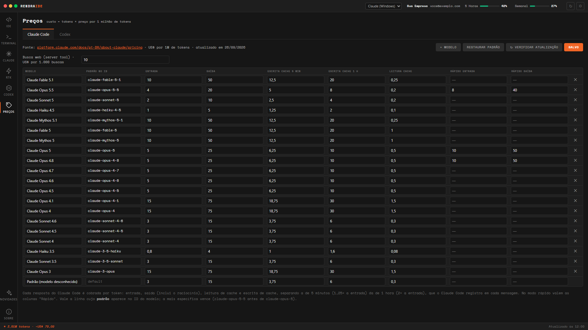
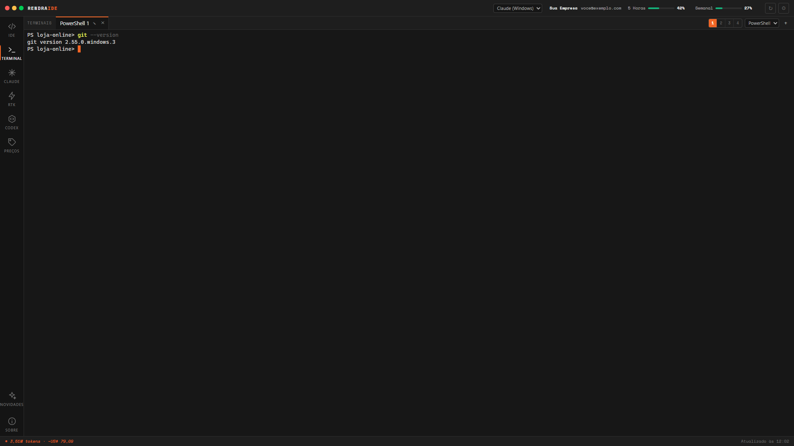
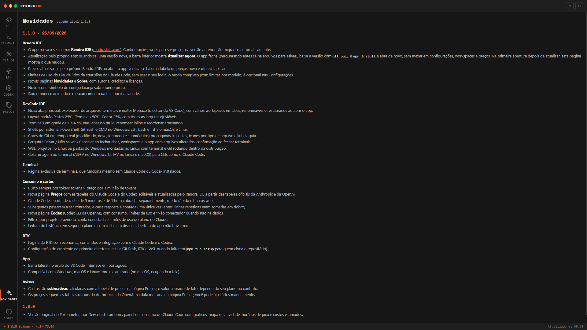
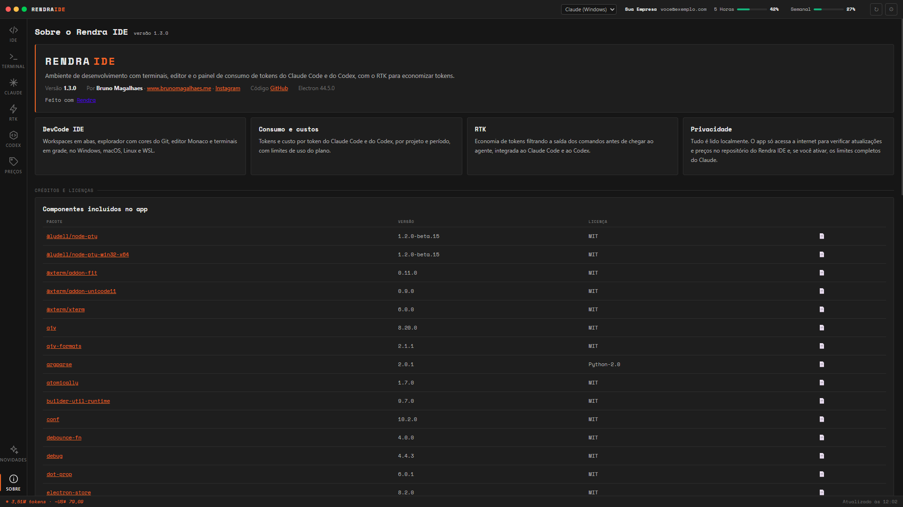

# Rendra IDE

**Ambiente de desenvolvimento gratuito e open source para quem programa com IA: terminais em grade, editor do VS Code, explorador com cores do Git e um painel que mostra quanto cada projeto consome de tokens no Claude Code e no Codex, com o custo calculado por token e os limites de uso do plano.** Tudo roda na sua máquina, lendo os arquivos locais das CLIs, e vem integrado ao [RTK](https://github.com/rtk-ai/rtk) para gastar menos tokens.

     [](https://github.com/bsmagalhaes/rendra-ide/actions/workflows/ci.yml)

**Veja funcionando, sem instalar nada:** [bsmagalhaes.github.io/rendra-ide](https://bsmagalhaes.github.io/rendra-ide/) · [galeria](https://bsmagalhaes.github.io/rendra-ide/#galeria) · [como instalar](#instalação) · [novidades](CHANGELOG.md)

| IDE: explorador, terminais e editor                                                       | Consumo do Claude Code                                                                          |
| ----------------------------------------------------------------------------------------- | ----------------------------------------------------------------------------------------------- |
| [](https://bsmagalhaes.github.io/rendra-ide/?imagem=ide) | [](https://bsmagalhaes.github.io/rendra-ide/?imagem=claude) |

| Codex CLI                                                                                     | Preços por token                                                                               |
| --------------------------------------------------------------------------------------------- | ---------------------------------------------------------------------------------------------- |
| [](https://bsmagalhaes.github.io/rendra-ide/?imagem=codex) | [](https://bsmagalhaes.github.io/rendra-ide/?imagem=precos) |

> As telas usam dados de demonstração, gerados a partir do app real com `npm run docs:images`.

---

## O que é

O Rendra IDE junta, numa janela só, o que você usa o dia inteiro quando programa com agentes de IA:

- uma **IDE leve**: workspaces em abas, explorador de arquivos com as cores do Git em tempo real, o **editor Monaco** (o mesmo do VS Code) e **terminais em grade** de 1 a 4 colunas, com PowerShell, Git Bash, CMD, zsh, bash, fish ou WSL;
- um **painel de consumo** do **Claude Code** e do **Codex CLI**: tokens e custo por projeto, por modelo e por período, atividade diária, horários de pico, mapa de 90 dias e sessões recentes;
- os **limites de uso do plano** (5 horas e semanal) sempre à vista;
- a integração com o **RTK**, que filtra a saída dos comandos antes de ela chegar ao agente e economiza tokens.

Três regras guiam o app:

1. **Custo é sempre por token.** Tokens × preço por 1 milhão de tokens, com escrita de cache de 5 minutos e de 1 hora cobradas separadamente, modo rápido e buscas web. Cada resposta da API é contada uma única vez, e os subagentes entram na conta.
2. **Tudo é local.** O app lê os arquivos que o Claude Code e o Codex já gravam na sua máquina. Não há conta, servidor nem telemetria.
3. **Nada se perde.** Configurações, workspaces, abas abertas e preços ficam na pasta de dados do app, e as atualizações nunca mexem nela.

---

## Galeria

> **Clique em qualquer imagem** para abri-la em tamanho real no [site](https://bsmagalhaes.github.io/rendra-ide/#galeria), com setas para passar e Esc para fechar.

| Terminal                                                                                          | Novidades de cada versão                                                                              |
| ------------------------------------------------------------------------------------------------- | ----------------------------------------------------------------------------------------------------- |
| [](https://bsmagalhaes.github.io/rendra-ide/?imagem=terminal) | [](https://bsmagalhaes.github.io/rendra-ide/?imagem=novidades) |

<details>
<summary><strong>Sobre, créditos e licenças</strong> (clique para abrir aqui mesmo)</summary>

[](https://bsmagalhaes.github.io/rendra-ide/?imagem=sobre)

</details>

---

## Funcionalidades

### IDE

| Recurso                  | Como funciona                                                                                                                                                                  |
| ------------------------ | ------------------------------------------------------------------------------------------------------------------------------------------------------------------------------ |
| **Workspaces**           | Um por pasta, em abas renomeáveis. Ao abrir o app, os workspaces, os terminais e as abas do editor voltam como estavam.                                                          |
| **Layout**               | Pastas 25% · Terminais 50% · Editor 25%, com todas as larguras ajustáveis.                                                                                                     |
| **Explorador**           | Cores do Git em tempo real (modificado, novo, ignorado, submódulo), propagadas às pastas, ícones por tipo de arquivo e linhas-guia.                                            |
| **Terminais**            | Grade de 1 a 4 colunas, abas no título, renomear inline e reordenar arrastando. Sempre abrem na pasta do projeto. Confirmação antes de fechar.                                 |
| **Shells**               | Windows: PowerShell, Git Bash e CMD. macOS e Linux: o shell de login, zsh, bash e fish.                                                                                         |
| **WSL**                  | Projetos no Linux, ou pastas do Windows abertas com terminal e Git rodando dentro da distribuição.                                                                             |
| **Editor**               | Monaco, com abas, divisão em quadros e a pergunta Salvar / Não salvar / Cancelar ao fechar abas, workspaces ou o app com arquivos alterados.                                    |
| **Imagens no terminal**  | Cole prints direto na CLI (Alt+V no Windows, Ctrl+V no macOS e Linux), como no Claude Code.                                                                                     |
| **Página Terminal**      | Terminais independentes, para quem só quer terminais, mesmo sem Claude Code ou Codex instalados.                                                                                |

### Consumo e custos

| Recurso                | Como funciona                                                                                                                                                                                  |
| ---------------------- | ---------------------------------------------------------------------------------------------------------------------------------------------------------------------------------------------- |
| **Claude Code**        | Tokens de entrada, saída, leitura e escrita de cache, custo estimado, economia com cache e projeção de 30 dias. Gráficos por dia e por hora, mapa de 90 dias, modelos, projetos e sessões.     |
| **Codex CLI**          | Consumo por projeto e modelo, em créditos (ou em US$, se você informar o valor do crédito), limites de 5 horas e semanal, e "Não conectado" quando o Codex não está instalado.               |
| **Filtros**            | Por projeto (vários ao mesmo tempo) e por período: hoje, 3, 7, 15, 30, 60 e 90 dias.                                                                                                           |
| **Limites do plano**   | Lidos da statusline do Claude Code: o app instala um pequeno script que registra os limites e continua executando a statusline que você já usava. Nenhuma senha ou token é lido.               |
| **Preços**             | Página editável com as tabelas do Claude Code e do Codex. Quando sai uma tabela nova no repositório, o app avisa ao abrir e aplica com um clique.                                              |
| **Desempenho**         | O histórico é lido em segundo plano e guardado em cache: o app abre na hora, mesmo com gigabytes de sessões.                                                                                  |

### RTK

Página do RTK com a economia de tokens, os comandos mais usados, o status da integração com o Claude Code e o Codex e um botão para ativar no Codex. A configuração do ambiente instala o RTK a partir das releases oficiais, com o checksum conferido.

---

## Stack

Electron 31, Monaco Editor, xterm.js com node-pty, Chart.js e electron-store, em JavaScript puro, sem framework nem etapa de build. Testes com o `node:test` do Node.js e CI no GitHub Actions (Windows, macOS e Linux). Somente bibliotecas gratuitas e de código aberto.

---

## Começar com IA

O repositório vem preparado para agentes de IA: o Claude Code lê o [`CLAUDE.md`](CLAUDE.md) e o Codex, o Cursor e os demais leem o [`AGENTS.md`](AGENTS.md), com a arquitetura, as regras do projeto e o passo a passo de versões. Abra o agente na pasta do projeto e peça, por exemplo:

```text
Leia o AGENTS.md e adicione ao painel do Claude um gráfico de custo por modelo nos últimos 30 dias.
```

---

## Instalação

Pré-requisitos: [Node.js](https://nodejs.org) 22.12 ou mais recente e [Git](https://git-scm.com).

```bash
git clone https://github.com/bsmagalhaes/rendra-ide
cd rendra-ide
npm install
npm start
```

Na primeira abertura, o Rendra IDE confere o ambiente e oferece instalar o que faltar: **Git Bash**, **RTK** e, no Windows, o **WSL**. Tudo vem das fontes oficiais de cada ferramenta. Se preferir fazer pelo terminal:

```bash
npm run setup
```

### Atualizações

O app confere o repositório ao abrir e a cada 6 horas. Quando sai uma versão nova, a barra inferior mostra **Versão X disponível · Atualizar agora**. Ao clicar, o app fecha (perguntando antes se há arquivos para salvar), baixa a versão com `git pull` e `npm install` e abre de novo na página Novidades. Configurações, workspaces e preços não mudam.

Se você alterou arquivos do próprio Rendra IDE, a atualização não sobrescreve nada: o app avisa e continua na versão atual. Pelo terminal, o equivalente é:

```bash
git pull
npm install
npm start
```

### Comandos

| Comando                  | O que faz                                                             |
| ------------------------ | --------------------------------------------------------------------- |
| `npm start`              | Abre o app                                                            |
| `npm run setup`          | Confere e instala Git Bash, RTK e WSL                                 |
| `npm run check`          | Confere a sintaxe, os JSON, o `index.html` e os arquivos obrigatórios |
| `npm test`               | Testes (cabeçalhos, atualização, cálculo de custo)                    |
| `npm run docs:images`    | Regera as imagens deste README com dados de demonstração              |

---

## Privacidade

Os dados de uso são lidos dos arquivos locais do Claude Code (`~/.claude/projects`) e do Codex (`~/.codex/sessions`) e ficam na sua máquina. O app acessa a internet apenas para:

- conferir se há versão nova e tabela de preços nova, neste repositório do GitHub;
- baixar Git, RTK ou WSL, quando você pede na configuração do ambiente;
- consultar os limites completos do Claude, somente se você ativar esse modo nas Configurações.

Os custos são estimativas pelo preço de tabela da API. O valor que você paga de fato depende do seu plano ou contrato.

---

## Estrutura

```text
main.js            processo principal do Electron: janelas, IPC, atualizações, preços, RTK
preload.js         ponte segura entre a interface e o processo principal
renderer/          interface: páginas, IDE (devcode.js), preços, novidades e sobre
src/               leitura das sessões do Claude Code e do Codex, custos, limites, IDE, setup
scripts/           setup do ambiente, atualização, release, verificações e imagens
test/              testes (node:test)
docs/              site do GitHub Pages e imagens
pricing.json       tabela de preços por token
```

---

## Documentação

- [CHANGELOG.md](CHANGELOG.md): o que mudou em cada versão (é o mesmo texto da página Novidades do app).
- [AGENTS.md](AGENTS.md): arquitetura, regras e comandos, para pessoas e agentes de IA.
- [CLAUDE.md](CLAUDE.md): instruções para o Claude Code e o manual de publicação de versões e preços.
- [LICENSE](LICENSE) e [licenses/](licenses/): licença do Rendra IDE e de terceiros.

---

## Perguntas frequentes

**O Rendra IDE é gratuito?**
Sim. Código aberto sob a licença MIT, sem conta, sem assinatura e sem telemetria.

**O custo mostrado é o que eu pago?**
Não necessariamente. É o custo equivalente pelo preço de tabela da API (tokens × preço por 1 milhão). Em planos por assinatura, serve para comparar projetos e modelos e ver onde o consumo está, não como fatura.

**Preciso ter o Claude Code ou o Codex instalados?**
Não. A IDE e a página Terminal funcionam sozinhas. As páginas de consumo aparecem preenchidas assim que houver sessões dessas CLIs na máquina.

**Funciona no macOS e no Linux?**
Sim. Os terminais se adaptam ao sistema (zsh, bash e fish no macOS e Linux; PowerShell, Git Bash, CMD e WSL no Windows).

**Como o app lê os limites do plano sem a minha senha?**
O Claude Code envia os limites de uso ao comando da statusline. O Rendra IDE registra esses dados num arquivo local e repassa tudo para a statusline que você já usava.

---

## Autor

Criado e mantido por **Bruno Magalhaes**.

- Site: [www.brunomagalhaes.me](https://www.brunomagalhaes.me)
- E-mail: [contato@brunomagalhaes.me](mailto:contato@brunomagalhaes.me)
- Instagram: [@brunomagalhaes.me](https://www.instagram.com/brunomagalhaes.me/)

Sugestões e problemas: abra uma [issue](https://github.com/bsmagalhaes/rendra-ide/issues).

## Licença

[MIT](LICENSE) © 2026 Bruno Magalhaes. Pode usar, copiar, alterar e distribuir, inclusive em projetos comerciais, mantendo o aviso de copyright.

## Créditos

- Baseado no **[Tokenmeter](https://github.com/DewashishCodes/tokenmeter)**, de **Dewashish Lambore**, sob a licença MIT. O aviso de copyright original é mantido no [LICENSE](LICENSE).
- **[RTK · Rust Token Killer](https://github.com/rtk-ai/rtk)**, © rtk-ai, Apache 2.0 ([texto da licença](licenses/RTK-LICENSE.txt)). Não vem embutido: é baixado das releases oficiais.
- **Git para Windows** (GPLv2) e **WSL** (Microsoft): instalados a partir das fontes oficiais, não distribuídos com o app.
- Construído sobre Electron, Monaco Editor, xterm.js, node-pty, electron-store e Chart.js, sob as licenças MIT, BSD e ISC. A lista completa, com os textos das licenças, fica na página **Sobre** do app.

Claude e Claude Code são marcas da Anthropic, PBC. OpenAI, ChatGPT e Codex são marcas da OpenAI. Windows e WSL são marcas da Microsoft. O Rendra IDE é um projeto independente, sem afiliação ou endosso dessas empresas.
